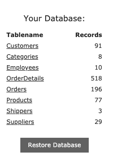

# Домашнее задание к занятию «1.2. Основы клиент-серверного взаимодействия»

## Задание 1

Один из распространённых кейсов для тестирования — тестирование веб-формы для регистрации или отправки данных. Подобные формы есть практически на любом сайте и веб-сервисе. 

Вы работаете с анкетой на получение банковской карты, которая включает шесть полей: имя, фамилию, отчество, телефон, дату рождения, серию и номер паспорта. 

На первый взгляд, форма выглядит работоспособной. Вам нужно проверить, доходят ли данные клиента до сервера. Если возникает ошибка, то определить, в какой момент она происходит, и передать информацию разработчику.

## Что нужно сделать:
1. Откройте [веб-страницу с анкетой](http://zayavka-na-kartu-2.sdew.ru/).
2. Заполните анкету.
3. Откройте консоль и определите, в какой момент возникает ошибка.
4. Опишите статусы, которые удалось получить: код ответа, что видит пользователь, что мы видим в консоли, какую информацию мы передадим программистам и почему её и прочее.

### Подсказка:
в поля ввода (ФИО) можно внести:
- редирект,
- потерян,
- плохой,
- неавторизованный,
- чайник,
- ошибка.

И получить соответствующий статус.

### Сдача домашнего задания

Выполненное домашнее задание нужно отправить на проверку в личном кабинете в виде ссылки на открытый для чтения текстовый файл [Google Docs](https://docs.google.com/document) или [Яндекс.Документ](https://docs.yandex.ru/). Название файла должно содержать номер лекции и фамилию студента. 

Перед тем как выслать ссылку, убедитесь, что её содержимое не приватное и открыто для просмотра всем, у кого есть ссылка.

## Задание 2 

В ходе юзабилити-тестирования выяснилось, что цвет не очень нравится пользователям и они хотят что-то поспокойнее. Наш дизайнер в отпуске, а программисты хотят начать работу над этим прямо сейчас. Вы решили помочь разработчикам в этом. 

Откройте [тестовую веб-страницу с формой](http://zayavka-na-kartu-2.sdew.ru/): 

1. Найдите на странице кнопку «отправить» и измените её цвет и цвет текста на ней на синий. 
2. Найдите на странице .png логотип банка и смените его на новый логотип, который лежит по данной [ссылке](https://netology.ru/dist/public/images/netology_b83461.png).
3. Воспроизведите на странице ошибку при заполнении формы и замените цвет текста ошибки на серый.
Результат домашнего задания — скриншот с исходной и получившейся страницей.

### Сдача домашнего задания

Выполненное домашнее задание нужно отправить на проверку в личном кабинете в виде ссылки на открытый для чтения текстовый файл [Google Docs](https://docs.google.com/document) или [Яндекс.Документ](https://docs.yandex.ru/). Название файла должно содержать номер лекции и фамилию студента. 

Перед тем как выслать ссылку, убедитесь, что её содержимое не приватное и открыто для просмотра всем, у кого есть ссылка.

## Задание 3 со звёздочкой (Необязательная задача)

Это дополнительное задание по SQL. Знания SQL часто проверяют на собеседованиях и для автоматизированных, и для ручных тестировщиков, поэтому предлагаем вам немного испытать себя. Подробнее работа с SQL будет разбираться в четвёртом модуле курса «Автоматизация тестирования». 

Для решения задания вы будете использовать онлайн-редактор, где сможете в режиме реального времени создавать запросы и выводить данные из таблиц. Ниже четыре задачи, которые нужно выполнить в редакторе. Для сдачи работы необходимо сделать скриншоты результатов поля «Result:» в каждой задаче и прикрепить эти скриншоты в личном кабинете.

### 3.1. Вывести все данные из одной любой таблицы

1. Перейдите по [ссылке](https://www.w3schools.com/sql/trysql.asp?filename=trysql_select_all).

2. Обратите внимание на правую сторону сайта, на список «Your Database:». Это список с таблицами, и вам необходимо выбрать одну из них, например, «Categories» или «Employees».  

3. В поле «SQL Statement:» введите запрос, с помощью команды «SELECT * FROM (название таблицы)» , которая сможет вывести все данные из выбранной вами таблицы, и далее нажмите зелёную кнопку «Run SQL».

4. Cделайте скриншоты результатов поля «Result:» по каждой задаче и прикрепите эти скриншоты к выполненной работе.

### 3.2. Вывести одну строку из выбранной вами таблицы

Выберите одну из строк таблицы из задачи 1 и создайте запрос с помощью команды «SELECT * FROM (название таблицы) WHERE (название столбца) = (значение); », которая сможет вывести выбранную вами строку, затем нажмите зелёную кнопку «Run SQL».

Используйте [ссылку](https://www.w3schools.com/sql/), чтобы посмотреть все типы запросов.
 
Чтобы попробовать решить задачу относительно выбранного вами запроса, выберите один из пунктов, например, «SQL Where», и прокрутив ниже, нажмите на зелёную кнопку «Try it Yourself»:

### 3.3. Обновить выведенную строку 

Теперь необходимо создать запрос, который обновит любые данные в этой строке с помощью команды update. 

### 3.4. Удалить обновлённую строку

И наконец, нам необходимо удалить обновлённую строку с помощью команды delete. 

Прикрепите скриншоты результатов поля «Result:» по каждой задаче в личном кабинете. Если у вас получилось выполнить только часть задач по SQL, то прикрепите те, что получилось.

_____________

Все задания обязательны к выполнению для получения зачёта, кроме дополнительных задач со звёздочкой. Присылать на проверку можно выполненные задания по отдельности или все вместе. Во время проверки по частям ваша домашняя работа будет обозначаться статусом «На доработке».

Любые вопросы по решению задач задавайте в чате учебной группы.

Выполненное домашнее задание нужно отправить на проверку в личном кабинете в виде ссылки на открытый для чтения текстовый файл Google Docs или Яндекс.Документ. Это не должен быть архив в облаке с документом.

Файлы, архивы и ссылки на облако через личный кабинет отправлять не нужно, только ссылку на документ.

Перед тем как выслать ссылку, убедитесь, что её содержимое не приватное и открыто для просмотра всем, у кого есть ссылка.
