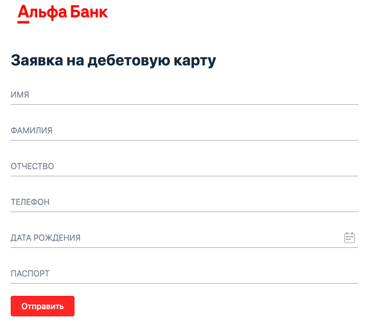

# Домашнее задание к занятию 1.2. «Основы клиент-серверного взаимодействия»

## Задание 1

Один из распространенных кейсов для тестирования — тестирование веб-формы для регистрации или отправки данных. Подобные формы есть практически на любом сайте и веб-сервисе. 

Вы работаете с анкетой на получение банковской карты, которая включает 6 полей (имя, фамилия, отчество, телефон, дата рождения, серия и номер паспорта). 

На первый взгляд форма выглядит работоспособной. Вам нужно проверить, доходят ли данные клиента до сервера. Если возникает ошибка, то определить в какой момент она происходит и передать информацию разработчику.

## Что нужно сделать:
1. Откройте веб-страницу с анкетой: http://zayavka-na-kartu-2.sdew.ru/;
2. Заполните анкету;
3. Откройте консоль и определите, в какой момент возникает ошибка;
4. Опишите статусы, которые удалось получить (код ответа, что видит пользователь, что мы видим в консоли, какую информацию мы передадим программистам и почему её, и пр.)

### Подсказка:
в поля ввода (ФИО) можно внести:
- редирект
- потерян
- плохой
- неавторизованный
- чайник
- ошибка

И получить соответствующий статус.

## Задание 2 `*` Дополнительная задача более сложного уровня:

В ходе юзабилити тестирования выяснилось, что красный цвет не очень нравится нашим пользователям и они хотят что-то поспокойнее. Наш дизайнер в отпуске, а программисты хотят начать работу над этим прямо сейчас. Вы решили помочь разработчикам в этом. 

Откройте тестовую веб-страницу с формой: http://zayavka-na-kartu-2.sdew.ru/. Найдите текст на странице и измените его размер и цвет. Измените расположение текста относительно других элементов на странице.

Результат ДЗ: скриншот с исходной и получившейся страницей.

## Сдача домашнего задания

Результат выполнения домашнего задания должен быть в виде ссылки на открытый для чтения файл  <a href="https://docs.google.com">Google Docs (!)</a> отправленный в личном кабинете на проверку. Название файла должно содержать номер лекции и фамилию студента. 

*Файлы, архивы и ссылки на облако через личный кабинет отправлять не нужно, только ссылку на документ!

Перед тем как выслать ссылку, убедитесь, что ее содержимое НЕ является приватным (Открыто на просмотр всем, у кого есть ссылка).

Все задания обязательны к выполнению для получения зачета, кроме дополнительных задач со `*`. Присылать на проверку можно выполненные задания по отдельности или все вместе. Во время проверки по частям ваша домашняя работа будет со статусом "На доработке".

Любые вопросы по решению задач задавайте в чате Slack.
